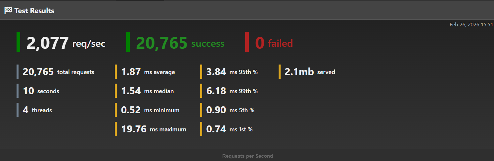

## 🚀 Distributed Currency Rate Service (.NET)



High-performance currency exchange service with distributed caching, Redis locking, and resiliency patterns for production environments.

This project demonstrates how to safely handle high concurrency requests for external APIs while preventing cache stampede using:

- Hybrid Cache (Memory + Redis)
- Distributed Lock (Redis)
- Cache Invalidation via Redis Pub/Sub
- Polly Resilience Policies
- Rate Limiting
- Multi-Node Deployment Simulation

## ✨ Architecture Goals
Problem:
> 100 concurrent requests ask for the same currency conversion.

Expected behavior:
- Only one request calls external API
- Other requests wait for cache population
- Cache shared across nodes
- No duplicate external calls
- Safe for horizontal scaling

## 🧠 Implemented Strategies
1 - Single Node High Performance

- Memory cache
- Optimized HttpClient
- Polly retry & timeout

2 - Hybrid Cache + Distributed Lock

- L1 → Memory Cache
- L2 → Redis Cache
- Redis Lock prevents cache stampede

3 - Fully Distributed Scenario (Multi-Node)

When multiple API instances run:
- Node A (5000)
- Node B (5001)

Flow:
- Both nodes receive request
- Redis lock acquired by one node
- Winner fetches external API
- Cache populated
- Lock released
- Other requests read cache

## 🧰 Tech Stack

- .NET 10
- ASP.NET Core Web API
- ِDocker
- Redis
- Polly
- Rate Limiting Middleware
- IHttpClientFactory

## 📡 Cache Invalidation (Redis Pub/Sub)
In a multi-node environment each API instance keeps its own local memory cache (L1).
When a cache entry changes or expires on one node, other nodes may still hold stale data.
To keep nodes consistent we use Redis Pub/Sub for cache invalidation.

How it works
1 - A node removes or refreshes a cache key
```bash
ExchangeRate_EUR
```
2 - That node publishes an event to Redis:
```bash
cache-invalidate:ExchangeRate_EUR
```
3 - All running API instances receive the message
4 - Each instance removes the key from its local cache
5 - Next request will fetch fresh data and repopulate cache

This pattern is called:
> Cache Invalidation via Pub/Sub

## 🐳 Running Multiple Nodes with Docker Compose

Docker Compose can start multiple API containers easily.
```bash
docker compose up --build
```

## ⭐ Architecture Summary
Multi-node consistency achieved with:
- SemaphoreSlim & ConcurrentDictionary(single-node locking)
- Hybrid Cache (L1 + Redis)
- Redis Distributed Lock
- Redis Pub/Sub Invalidation

⭐ If This Helped You

Give the repo a star ⭐